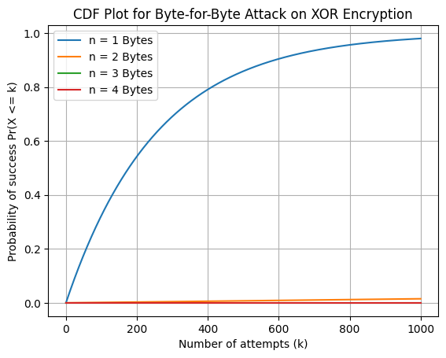
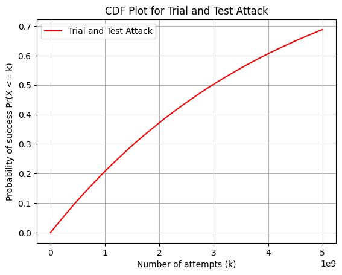
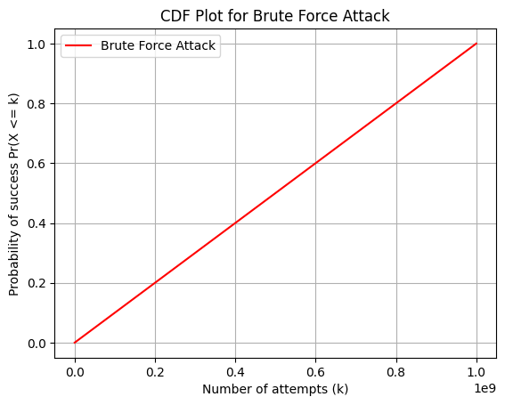
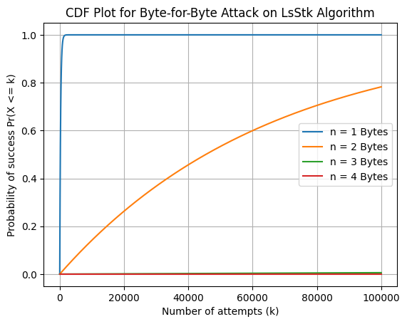

# LsStk: Lightweight Solution for Buffer Overflow Prevention

## 📘 Overview
**LsStk** is a project focused on preventing buffer overflow vulnerabilities using a lightweight encryption-based solution. Buffer overflow attacks are a common security threat, especially in embedded and IoT devices with limited resources. The **LsStk** algorithm aims to secure function return addresses against exploitation while maintaining a low computational footprint, making it ideal for resource-constrained environments.

## 🔍 Key Features
- **Encryption-Based Protection**: Uses a lightweight encryption algorithm to protect return addresses in the stack.
- **Statistical Analysis of Attack Models**: Simulates and evaluates various attack scenarios, including:
  - Trial and Test Attack
  - Byte-for-Byte Attack on XOR and LsStk Encryption
  - Brute Force Attack
- **CDF Analysis**: Provides Cumulative Distribution Function (CDF) plots to demonstrate the probability of attack success under different conditions.

## 📈 Visualizations

### 1. Trial and Test Attack
This plot shows the CDF for the Trial and Test attack, highlighting the probability of successful exploitation across a range of attempts.


### 2. Byte-for-Byte Attack on XOR Encryption
This plot compares the success rates for different byte lengths (n=1, n=2, n=3, n=4) in a Byte-for-Byte attack scenario using XOR encryption.


### 3. Brute Force Attack
This CDF plot illustrates the probability of success for a brute force attack, showing a linear increase in success probability as the number of attempts grows.


### 4. Byte-for-Byte Attack on LsStk Algorithm
This plot demonstrates the effectiveness of the LsStk algorithm in preventing byte-for-byte attacks, with varying byte lengths (n=1 to n=4).


## 🧩 Project Structure
- `notebook.ipynb`: Main analysis and simulation notebook containing the code for encryption, statistical analysis, and plotting.
- `output/`: Folder containing generated CDF plots.
- `data/`: Sample data files (if any) used in simulations.
- `LICENSE`: MIT License.

## 🛠️ Installation and Usage
1. **Clone the Repository**:
   ```bash
   git clone https://github.com/your_username/LsStk.git
   cd LsStk
